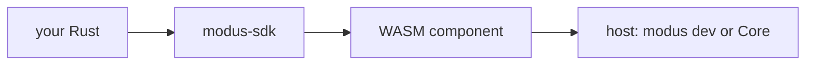

# Author contract

If this is your first plugin — [tutorial](../start/00-intro.md), toolchain in [chapters 1–3](../start/01-tools.md). If you need the contract — this chapter.

**Rule.** The public path is crate `modus-sdk` + manifest + CLI `modus`. Authors do not copy WIT or `wasm-tools`.

## Layers



Guest code → SDK (canon, `wait`, `HostError`, `export!`) → bindings inside the SDK → host imports → Wasmtime. The sandbox gets the same component as raw bindgen. The SDK is not a second ABI and not a grant bypass.

Not in WIT — not in the SDK. The SDK does not inject WASI: `wasi:*` in the component always fails `pack` / load.

## Truth on disagreement

If an SDK wrapper disagrees with WIT — **WIT (host) wins**. Fix the bug in the SDK; official plugins are not taken off it.

Raw `wit_bindgen::generate` is accepted by the host if the component is valid. Directory `pack` / `check` **refuse** if the same crate has both `modus-sdk` and `wit_bindgen::generate` in `src/**/*.rs`. String: `WIT вручную плюс SDK — два bindgen`.

New package: SDK feature; do not copy a `lib.rs` with raw bindgen.

## Versions

Major of crate `modus-sdk` = ABI. Currently `2.0.0` only with `"abi": 2` in the manifest. Breaking WIT — new SDK major in the same release as the ABI.

The host loads only `abi: 2`. An old package with ABI 1 will not load. Pin the SDK version in the plugin `Cargo.toml`. WIT lives inside the SDK; do not “download world.wit from master”.

One package — **one** SDK role-feature (`consumer` | `emitter` | … | `commander` | `store`). The WIT world is always **`plugin`**. Two features at once — `compile_error`. This is not “one product role”: listen on the bus and emit — `emitter` or `connector`, not two features. Map — [next chapter](01-roles.md).

CLI from [modus-sdk](https://github.com/CaptainGnome/modus-sdk) (not crates.io). From the SDK clone root:

```powershell
cargo run --manifest-path cli/Cargo.toml --release -- <command>
```

- `--manifest-path cli/Cargo.toml` — CLI package; you are at the `modus-sdk` root.
- At the product root (submodule): `modus-sdk/cli/Cargo.toml`.
- `--release` — optimized `modus` binary.
- `--` — further args are for `modus`, not cargo.
- Alias `modus` — [tutorial, chapter 1](../start/01-tools.md). Below we write `modus`.

Cycle: `new` → `dev` → `pack` → Core. Debug in the terminal, not by installing a `.mplug`.

## Reference plugins

Build **only** with the SDK (world always `plugin`, feature = preset):

| Directory | Feature | Role |
| --- | --- | --- |
| [`plugins/consumer`](../../../plugins/consumer) | `consumer` | listens on the bus |
| [`plugins/fixture`](../../../plugins/fixture) | `emitter` | puts canon without platform network |
| [`plugins/twitch`](../../../plugins/twitch) | `connector` | platform |
| [`plugins/web-slot`](../../../plugins/web-slot) | `widget` | OBS slot + wasm channel |
| [`plugins/panel`](../../../plugins/panel) | `widget` | native panel in the dock |
| [`plugins/alerter`](../../../plugins/alerter) | `alerter` | queue + web overlay |
| [`plugins/store`](../../../plugins/store) | `store` | KV |
| [`plugins/commander`](../../../plugins/commander) | `commander` | `chat.act` |

Host WIT — [`wit/world.wit`](https://github.com/CaptainGnome/modus-sdk/blob/main/wit/world.wit) in [modus-sdk](https://github.com/CaptainGnome/modus-sdk) (adjacent: [`../../../modus-sdk/wit/world.wit`](../../../modus-sdk/wit/world.wit)). Look when porting the SDK or arguing with the host. Do not copy into the plugin. Capability → SDK module table — [role map](01-roles.md); WIT as appendix — [chapter 11](11-wit.md).

Secrets: not in wasm, not in the manifest (`client_secret` — refuse), not in logs. `new connector` does not set `broker`, the official Twitch `client_id`, or Twitch hosts.
