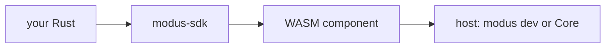

# Who this is for and what to expect

If this is your first plugin — read this chapter and continue through the tutorial. If you already know Rust and need the ABI contract — [reference](../README.md#reference).

## What a plugin is

**Modus** (also **Core** in this text) is a streamer app. It holds chat, secrets, network as a sandbox, and the alert queue.

A plugin is not a website and not a bot with its own socket. It is a module inside the app. The host delivers chat. Network exists only if you asked for it in the manifest, like a wall outlet: the plugin itself does not go to the internet.

The guest lives in WASM: no disk, no own sockets, no access to the streamer's files.

The host only allows what the manifest permits. A manifest entry without a call in code is fine. A call without an entry — the package will not build and will not load.

## Three words worth being able to repeat

1. **Bus** — canonical events (`message`, `donation`, and the rest). A platform connector or a teaching fixture puts them there. A consumer only listens.
2. **`wait`** — the only long loop in `run`. The plugin calls `wait` and sleeps. The host wakes it when there is chat, a timer, stop, or a command. You cannot “listen” elsewhere yourself: one `run`, one mailbox.
3. **Mailbox** — a useful way to think about `wait`: the host drops a letter, the plugin takes it and waits again.

More precise detail on the loop and canon is in the reference when you get there.

## What you get after the tutorial

Part 1 (no connector, about 2–4 hours):

1. install the toolchain;
2. generate a consumer;
3. see `fixture hello` in the terminal;
4. understand that the host provides network, not wasm;
5. pack a `.mplug` and know where to put it in the app;
6. tell consumer from connector and not start with Twitch.

You will write a **bus listener**, not a Twitch clone. This tutorial does not promise a platform, OAuth, an OBS overlay, or a commander.

Panel, chat history, sound, bridges — **not available in a plugin**. One sentence, no “later” chapters.

## What you need

- Windows — same as the product.
- Rust stable and the `wasm32-unknown-unknown` target (we install them in the next chapter).
- This repository: the SDK lives here for now, not on crates.io.
- PowerShell, so you can copy commands.

Node is not needed for the plugin itself. The streamer app (Tauri) — only at the end of part 1, when you install the `.mplug`. Debugging is `modus dev` in the terminal, not the Core window.

One language: **Rust**. We do not promise others.

## Two texts

| Path                                  | For whom                 | How to read                                                 |
| ------------------------------------- | ------------------------ | ---------------------------------------------------------- |
| [Tutorial](../README.md#tutorial)     | first plugin             | top to bottom; each chapter yields a terminal line or a file |
| [Reference](../README.md#reference)   | contract, limits, errors | from the table of contents                                 |

Commands, identifiers, and host error strings — as in the ABI, without “improving” the translation.

Next chapter — [install tools](01-tools.md).
