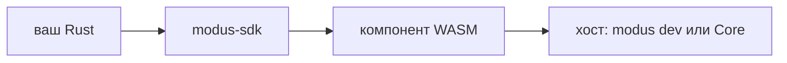

# Контракт автора

Если это первый плагин — [туториал](../start/00-intro.md), тулчейн в [главах 1–3](../start/01-tools.md). Если нужен контракт — эта глава.

**Правило.** Публичный путь — crate `modus-sdk` + манифест + CLI `modus`. WIT и `wasm-tools` автор не копирует.

## Слои



Код гостя → SDK (канон, `wait`, `HostError`, `export!`) → биндинги внутри SDK → импорты хоста → Wasmtime. В песочницу попадает тот же компонент, что с сырого bindgen. SDK не второе ABI и не обход грантов.

Нет в WIT — нет в SDK. WASI SDK не подмешивает: `wasi:*` в компоненте — всегда отказ `pack` / загрузки.

## Правда при расхождении

Расхождение обёртки SDK и WIT — **правда у WIT** (хост). Баг чинится в SDK, официальные плагины с него не снимают.

Сырой `wit_bindgen::generate` хост примет, если компонент валиден. `pack` / `check` каталога **откажут**, если в том же crate есть и `modus-sdk`, и `wit_bindgen::generate` в `src/**/*.rs`. Строка: `WIT вручную плюс SDK — два bindgen`.

Новый пакет: feature SDK, не копировать `lib.rs` с сырым bindgen.

## Версии

Мажор crate `modus-sdk` = ABI. Сейчас `2.0.0` только с `"abi": 2` в манифесте. Ломающий WIT — новый мажор SDK в тот же релиз, что ABI.

Хост грузит только `abi: 2`. Старый пакет с ABI 1 не загрузится. Пин версии SDK в `Cargo.toml` плагина. WIT лежит внутри SDK, не «скачай world.wit из master».

Один пакет — **одна** role-feature SDK (`consumer` | `emitter` | … | `commander` | `store`). WIT-world всегда **`plugin`**. Две feature сразу — `compile_error`. Это не «одна продуктовая роль»: слушать шину и emit — `emitter` или `connector`, не две feature. Карта — [следующая глава](01-roles.md).

CLI из этого репозитория, не crates.io:

```powershell
cargo run --manifest-path modus-sdk/cli/Cargo.toml --release -- <команда>
```

- `--manifest-path modus-sdk/cli/Cargo.toml` — пакет CLI, вы стоите в корне репо.
- `--release` — оптимизированный бинарник `modus`.
- `--` — дальше аргументы `modus`, не cargo.
- Alias `modus` — [туториал, глава 1](../start/01-tools.md). Здесь дальше пишем `modus`.

Цикл: `new` → `dev` → `pack` → Core. Отладка в терминале, не установка `.mplug`.

## Эталоны

Собирать **только** с SDK (world всегда `plugin`, feature — пресет):

| Каталог | Feature | Роль |
| --- | --- | --- |
| [`plugins/consumer`](../../plugins/consumer) | `consumer` | слушает шину |
| [`plugins/fixture`](../../plugins/fixture) | `emitter` | кладёт канон без сети площадки |
| [`plugins/twitch`](../../plugins/twitch) | `connector` | площадка |
| [`plugins/web-slot`](../../plugins/web-slot) | `widget` | OBS-слот + канал wasm |
| [`plugins/panel`](../../plugins/panel) | `widget` | native-панель в доке |
| [`plugins/alerter`](../../plugins/alerter) | `alerter` | касса + web overlay |
| [`plugins/store`](../../plugins/store) | `store` | KV |
| [`plugins/commander`](../../plugins/commander) | `commander` | `chat.act` |

WIT хоста — [`modus-sdk/wit/world.wit`](../../modus-sdk/wit/world.wit). Смотреть при порте SDK или споре с хостом. Не копировать в плагин. Таблица capability → модуль SDK — [карта ролей](01-roles.md); WIT как приложение — [глава 11](11-wit.md).

Секреты: не в wasm, не в манифесте (`client_secret` — отказ), не в лог. `new connector` не ставит `broker`, официальный Twitch `client_id` и хосты Twitch.
